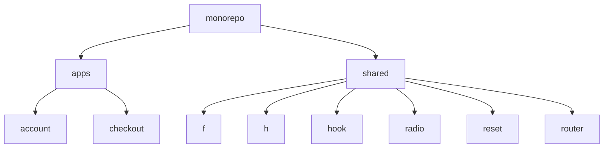

Stan Lee
========
:star2: `Grandes códigos vem com grandes resposabilidades.` :star2:


Bem vindo ao **Stan Lee**.
Que não traz esse nome por acaso, como o [famoso criador e escritor](https://pt.wikipedia.org/wiki/Stan_Lee) do universo Marvel, o projetos se trata de um **Monorepo do grupo C&A**, uma estratégia de desenvolvimento de software onde multiplos projetos são armazenados em um único repositório.

### Vantagens
  - **Reutilização de código:** Funcionalidades semelhantes ou comunicações, podem ser compartilhadas entre os projetos, sem a necessidade de muitas dependências.
  - **Gerenciamento de dependências:** A construção pode ser facilmente optimizada, havendo um grande reuzo de dependências na mesma base de código.
  - **Refatoração de códigos:** Tendo acesso a toda a base de código os desenvolvedores, podem garantir que todo ecossistema estará funcionando à cada rafatoração.
  - **Colaboração entre equipes:** As dependências são compartilhadas à partir da fonte, as equipes podem ter visão e reutilização de códigos escritos por outras equipes.

### Desvantagens
  - **Versionamento:** Como cada projeto do repositório tem suas versões, acaba gerando uma complexidade alta para a gerência de versões.
  - **Segurança:** Acesso de leitura a todo o projeto, possivelmente apresentando novas questões de segurança.

## Sumário
  1. [Dependências](#1-dependências)
  2. [Estrututura do projeto](#2-estrututura-do-projeto)
  3. [Comandos](#3-comandos)

## 1. Dependências
  - [Node.js](https://nodejs.org) - `versão 12.18.0 ou superior`
  - [Yarn](https://yarnpkg.com) - `versão 1.17.3 ou superior`

**Obs.** Versões listadas podem estar desatualizadas, consulte sempre o arquivo [package.json](./package.json) para saber as versões corretas.

## 2. Estrututura do projeto
O projeto é composto de projetos onde **apps** contém os arquivos de cada projeto individual `(Ex. accout, checkout, etc)`, **shared** contém projetos que serão compartilhados `bibliotecas (f, h)`.
Na raíz ficará os arquivos do monorepo.
Cada um terá suas dependências, configurações e etc de maneira individual.

**Exemplo Ilustrativo**


**Projetos**
  - [apps](./apps/README.md)
  - [shared](./shared/README.md)

## 3. Comandos
  **Não é necessário 'fazer npm install'**

  #### Setup
  ``` bash
    # Montagem do setup do projeto
    $ yarn setup
  ```

  #### Testes
  ``` bash
    # Execução dos testes
    $ yarn test
  ```

  #### Build
  ``` bash
    # Gerar pacotes para produção
    $ yarn build
  ```

  ``` bash
    #Inicia o webpack dev server
    $ yarn workspace @cea/account start

    #Inicia os testes para as bibliotecas
    $ yarn workspace @cea/checkout dev
  ```